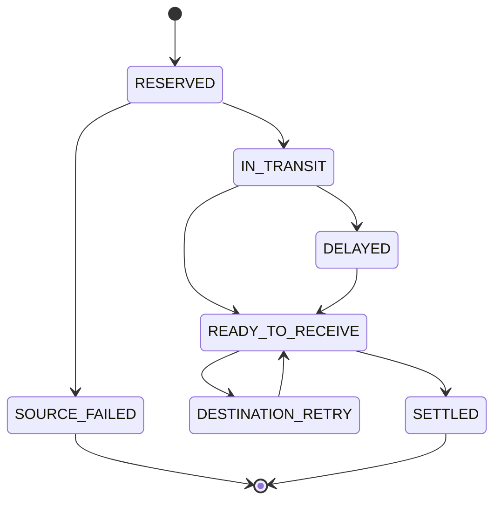
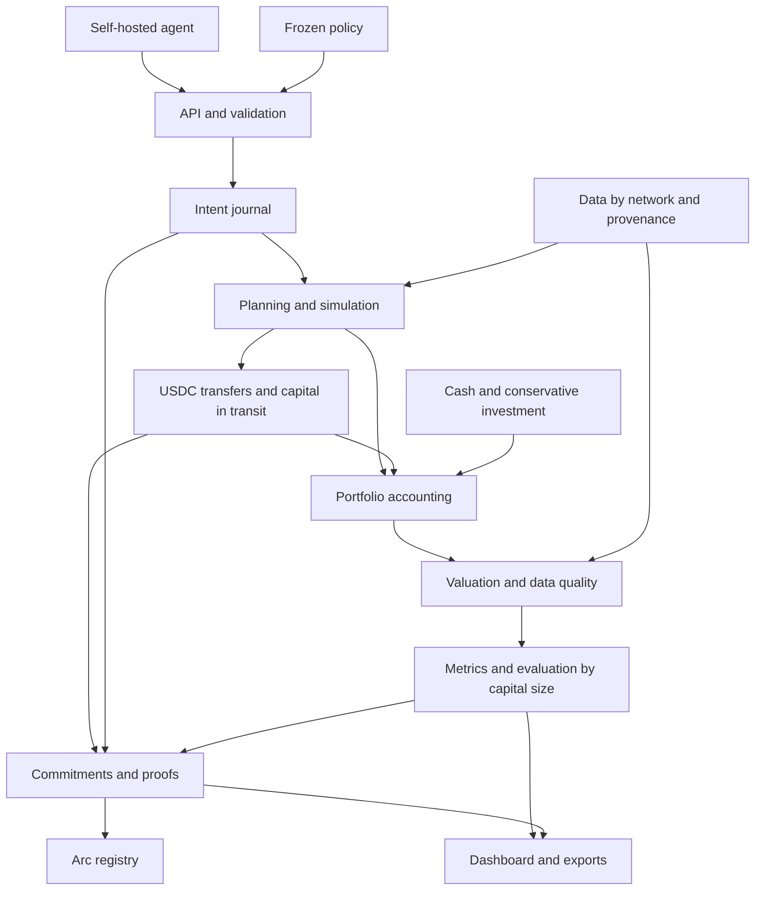

# Proof of Alpha

## Project description, operation, and technical architecture

**Version:** 0.3 — working document for review  
**Date:** September 5, 2026  
**Context:** preparation for the ETHGlobal Online 2026 MVP  
**First mandate:** stablecoin treasury management on Ethereum and Arc, with USDC transfers  
**Scope:** prospective evaluation using virtual capital, without automatic allocation of real funds

This version incorporates the full specification and integrates Ethereum and Arc as DeFi market blockchains, with USDC reallocation between them. Arc is not limited to a registry or a means of paying for the service. Each capital size tested corresponds to a global treasury, including local positions and capital in transit. Section 29 brings together the agreed choices, proposed parameters, and integrations still awaiting validation. No deployment or transfer was carried out in preparing this document.

---

## 1. Executive summary

Proof of Alpha is a prospective evaluation infrastructure for self-hosted financial agents. Its first environment is stablecoin treasury management on Ethereum and Arc: an agent seeks the best possible net return within an authorized universe, subject to risk, liquidity, and concentration constraints. It can change investments on each chain and transfer USDC between them through a single configured mechanism.

The creator registers their agent and declares its version. At a date `X`, the rules of an experiment are locked: accessible instruments, initial capital, comparison references, execution model, valuation method, and evaluation policy. The agent continues to run on its creator's infrastructure and calls the API whenever it wants to change an allocation.

Proof of Alpha receives a signed intent, records it, and simulates its consequences using market conditions actually observed after receipt, according to a timing rule set in advance. The engine accounts for withdrawals, deposits, required swaps, fees, gas, and liquidity constraints.

Several independent virtual portfolios represent different sizes of global capital. The agent can act differently for each size. Within a scenario, Ethereum positions, Arc positions, and transfer receivables belong to a single treasury: capital is never duplicated across chains. Two fixed references evolve in parallel from the same initial distribution: USDC cash and a conservative passive investment declared before the start.

The product reports three separate dimensions:

1. **Operational compliance:** adherence to the rules and incidents encountered.
2. **Observed economic performance:** returns, costs, observable risks, and results for each capital size tested.
3. **Strength of statistical evidence:** whether the history is sufficient to reach a conclusion under the chosen method.

The data, calculations, and commitments make the track record auditable. The blockchain makes commitments verifiable, but does not guarantee the code running on the creator's infrastructure, the economic accuracy of the simulation, or the server timestamp preceding their publication.

The hackathon demonstrates how this infrastructure works. It does not claim to establish lasting alpha in a few days. An `INSUFFICIENT_EVIDENCE` result is entirely normal. Progressive access to real capital remains the post-MVP vision.

**Network status checked during this revision:** the official sources consulted document Arc Testnet and a transfer flow with Ethereum Sepolia. They do not establish that an Arc mainnet market has already been validated. The product targets global economic evaluation in real markets; for the MVP, the cross-chain flow is demonstrated on testnet, while prospective Ethereum mainnet evidence remains in a separate experiment. Provenance rules are detailed in Section 5.4. [Connecting to Arc](https://docs.arc.io/arc/references/connect-to-arc), [official bridge flow](https://docs.arc.io/app-kit/quickstarts/bridge-tokens-across-blockchains).

## 2. The problem and reasons to build the project

### 2.1 Results presented by an agent are difficult to evaluate

A backtest may use a favorable period, parameters selected after observing the results, unrealistic costs, or data unavailable at the supposed decision time. A creator may also publish only their best variant. A convincing explanation produced by an LLM does not demonstrate a sound financial decision.

Proof of Alpha provides a common framework: record decisions over time, preserve their consequences, and explain how performance was calculated.

### 2.2 Testing with real capital immediately exposes funds to losses

Virtual capital allows behavior to be observed and errors to be eliminated before a potential real mandate. It does not remove the need for later validation under real execution conditions: shadow results remain model-dependent.

### 2.3 Capital size changes a strategy's economics

Fixed costs weigh more heavily on a small portfolio. Larger amounts may encounter liquidity limits, caps, and greater market impact. Scaling a strategy down from 100,000 to 100 USDC to “test it without risk” can therefore change its behavior and profitability.

### 2.4 Value exists before funding

The first target user is the agent creator. They need to understand where their strategy gains or loses: allocation, costs, overly frequent changes, exposure, liquidity, or capital constraints. A shareable report can then become useful to investors or treasury managers.

## 3. Vision: one general protocol, several mandates

A **mandate** defines the problem assigned to the agent: objective, instruments, acceptable risks, constraints, and evaluation horizon. “Maximize profit” must always be accompanied by these parameters.

| Mandate | Objective | Place in the project |
|---|---|---|
| Ethereum + Arc stablecoin treasury | Maximize net return, including investments and transfers | First MVP, with explicit network provenance |
| Directional trading | Seek capital gains with bounded exposure and losses | Future |
| Prediction markets | Exploit probability discrepancies within a risk budget | Future |
| Market making | Seek a margin while controlling inventory and execution | Future |

Identities, experiments, signatures, journals, references, and reports can be shared. Each family nevertheless requires its own accounting, valuation rules, and execution model. A vault adapter is not enough to simulate an order queue or market resolution.

Proof of Alpha evaluates financial behavior within a specific framework. It does not quantify an AI's general intelligence and does not require the agent to use an LLM: a deterministic policy can also be evaluated.

## 4. Hackathon objectives and success criteria

### 4.1 Essential end-to-end flow

The MVP must support configuring an experiment, locking its rules, receiving signed intents from an external agent, simulating the required operations, maintaining portfolios and their references, calculating explainable results, and publishing verifiable commitments.

Concrete criteria:

- A demonstration agent runs outside the protocol's infrastructure and actually uses the API.
- Three independent capital scenarios work end to end.
- The selected Ethereum lending market and vaults, a demonstration DeFi investment on Arc, at least one swap, and USDC transfers in both directions are covered.
- Actual test-token transfers demonstrate the integration; shadow capital scenarios remain virtual and separate.
- Market fees, source and destination gas, and applicable transfer fees are deducted, rather than merely displayed alongside returns.
- Capital in transit is counted only once, unavailable until receipt is confirmed, and earns no investment yield during the transfer.
- Errors and losses remain in the history.
- An export allows a result to be reproduced from archived data and the engine version.
- A proof of inclusion in an on-chain commitment can be verified from the dashboard.
- The report distinguishes data quality, observed return, and statistical evidence.

### 4.2 Result provenance

| Source | Purpose | Status in the track record |
|---|---|---|
| Forward testing on mainnet data | Observe new decisions | Simulated prospective history |
| Historical replay | Validate the engine and show a complete flow | Diagnostic, excluded from the prospective track record |
| Synthetic scenario | Test failures, stress conditions, and interfaces | Test, excluded from the prospective track record |
| Optional actual mainnet transaction | Compare an observed execution with its simulation | Separate live history |
| Ethereum Sepolia ↔ Arc Testnet transfer and Arc test investment | Verify integration and the complete lifecycle | Evidence of technical functionality, no evidence of economic return |
| Simulation combining mainnet data with Arc test assumptions | Optional diagnostic only | `MIXED_DIAGNOSTIC`, excluded from real-capital eligibility |

Calculations can be demonstrated on a long replay without turning its results into prospective evidence. No execution with real funds on mainnet is required; demonstration transfers and investments use test tokens.

## 5. Initial financial universe

### 5.1 A limited but economically varied universe

The agreed scope includes Ethereum and Arc as investment chains, with USDC as the unit of account and transfer asset. On Ethereum, the proposed catalog includes Aave V3 USDC/USDT supply, two selected USDC vaults, and Uniswap V3 for USDC/USDT swaps. USDT stays on Ethereum in the MVP: reallocation to Arc first goes through USDC.

Arc must provide a working deposit, position-tracking, and withdrawal flow in the demonstration. Until an Arc mainnet market is validated, the component selected for this flow is a demonstration ERC-4626 vault using test USDC, explicitly deployed or selected on Arc Testnet. Its addresses and test-yield mechanism must be validated before integration; it is not presented as an existing commercial or conservative investment.

The exact number of vaults may be reduced if the adaptation work requires it. The priority is to retain several distinct economic choices, including a flow with a swap, rather than multiply nearly equivalent addresses.

| Instrument | Role | Intended distinction |
|---|---|---|
| USDC cash | Available reserve | No additional investment |
| USDC lending | Variable-yield investment | Liquidity, caps, and lending-specific mechanics |
| USDC vault | Another authorized allocation | Different exposure or yield source |
| USDT supply on Ethereum | Allocation following a USDC/USDT swap | Yield, USDT exposure, and conversion costs |
| USDC vault on Arc | Investment on the second chain | Local costs, exit conditions, and transfer cost; testnet in the current demonstration |
| USDC in transit | Receivable, not an investment | Temporarily unavailable capital, fees, and settlement risk |

A vault share or a token representing a deposit may already be a yield-bearing asset. “Yield-bearing token” therefore does not automatically require a third independent integration.

### 5.2 Instrument selection and fact sheet

Instruments are selected based on data availability and the ability to model their operation correctly. Each fact sheet records contracts, assets, yield mechanism, fees, limits, exit conditions, and known underlying dependencies.

Two vaults exposed to the same protocol must be identified as such. A manually maintained, versioned fact sheet is sufficient for the MVP; no universal safety score is promised.

### 5.3 Mandate constraints

The profile specifies authorized assets, concentration caps, available cash reserves per chain, exposure to the second stablecoin, slippage limits, a cost budget, and liquidity limits. Ethereum ↔ Arc USDC transfers are included. The MVP excludes borrowing, leverage, comparisons across multiple bridges, transfers of other assets, complex asynchronous vault withdrawals, concentrated liquidity provision, and derivatives.

USDC is the unit of account, not a promise of dollar stability. A decline in USDC against the dollar is not visible in a portfolio measured solely in USDC; an indicative USD view can supplement the report without replacing its canonical measurement.

### 5.4 Networks and provenance: three distinct profiles

| Profile | Networks and data | Permitted result |
|---|---|---|
| `ETHEREUM_MAINNET_FORWARD` | Ethereum mainnet markets, shadow capital; registry optionally on Arc Testnet | Prospective economic history limited to Ethereum |
| `CROSS_CHAIN_TESTNET` | Ethereum Sepolia ↔ Arc Testnet, CCTP, and test investments | Demonstration of global treasury management and transfers; no real-capital eligibility |
| `CROSS_CHAIN_MAINNET_FORWARD` | Ethereum mainnet ↔ Arc mainnet, validated markets and route | Target profile, disabled until these prerequisites are verified |

Sepolia USDC cannot be transferred as Ethereum mainnet USDC. No actual Ethereum mainnet → Arc Testnet CCTP route is assumed to be available. Circle documents the Sepolia ↔ Arc Testnet flow; its domain identifiers are distinct from chain IDs. [CCTP networks](https://developers.circle.com/cctp/concepts/supported-chains-and-domains), [official transfer example](https://docs.arc.io/app-kit/quickstarts/bridge-tokens-across-blockchains).

The same agent may participate in two separate experiments. Data and capital are not implicitly shared between them. If an experimental view mixes mainnet and testnet data, the whole remains a diagnostic: the Ethereum portion of a strategy whose decisions were influenced by artificial Arc yield is not certified separately. A future mainnet deployment opens a new experiment; it does not retroactively convert testnet history.

### 5.5 Arc demonstration investment

The test vault must accept test USDC deposits and withdrawals and expose its shares and limits. Any demonstration yield distribution is funded by a test-token budget and a schedule published before X, with a finite amount; no supposedly real APY is invented. This mechanism tests accounting and allocation, not the agent's economic competence.

The official Arc Borrow & Lend sample demonstrates borrowing USDC against cirBTC collateral; by itself, it is not evidence of a USDC supply market meeting our mandate. It may serve as a technical reference but is not integrated as an assumed yield source. [Circle sample](https://github.com/circlefin/arc-defi-lend-borrow).

## 6. Participants, hosting, and responsibilities

| Participant | Hosts or uses | Responsibility |
|---|---|---|
| Creator | Their server, agent, models, prompts, and keys | Decisions, agent availability, and version declaration |
| Agent | Public API and optional SDK | Read its portfolios and sign intents |
| Proof of Alpha operator | API, workers, storage, dashboard, and blockchain publication | Receipt, simulation, global accounting, transfer tracking, and proofs |
| Transfer relayer / attestation service | Authorized CCTP route and optional destination gas funding | Track settlement; costs and dependency are separate from the agent's decision |
| Data providers | RPC, indexing, and quotes | Access to market states used by the engine |
| Verifier or investor | Dashboard, exports, and commitments | Examine the method, limitations, and results |
| Future capital provider | Mandate policy and real wallet | Decide whether to provide funding and under which restrictions |

Proof of Alpha neither receives nor executes the agent's code. Its CPU and GPU resources, inference, and private sources remain the creator's responsibility. Only the commitment-publication key belongs to the service; the decision key belongs to the agent or its operator.

Not hosting agents avoids that specific risk, but the public API still requires authentication, strict validation, quotas, and handling of abusive requests.

## 7. Trust model and declared strategy

### 7.1 What is frozen at X

The experiment fixes the identity, declared version, mandate, network profile, universe, initial global capital and its distribution, references, local execution and transfer rules, limits, statistical method, deadline, and anchoring mode. It includes the adapter and canonical engine versions. Fee amounts and market states may vary: what is locked is the method used to capture and calculate them.

A policy change opens a new experiment. A change to an address or rule cannot be silently applied to an existing history.

### 7.2 What remains self-reported

The creator may declare hashes of code, prompts, parameters, model, tools, memory, and sources. The protocol cannot prove that these components are actually running on the creator's infrastructure. A human may intervene without this being detectable from the decision stream alone.

The expected rule is to retain the declared strategy after `X`, including its capital-adaptation logic. An official change results in a new version and a new experiment. The possibility of a concealed modification remains explicitly acknowledged in the report's scope.

### 7.3 What “prospective” means

The agent may use historical data to prepare or make a decision. What counts in the track record is the decisions recorded after the start and their subsequent consequences. A decision cannot retroactively receive an execution at a historical price selected by its author.

The protocol does not prove which private data the agent consulted. The canonical timeline is that of receipt and simulated execution, not the timestamp declared by the client.

### 7.4 Guarantees displayed separately

| Dimension | Actual MVP guarantee |
|---|---|
| Identity | Signature verified against an authorized key |
| Runtime | `SELF_REPORTED`: execution is not attested |
| Receipt | Timestamp attested by the server |
| Integrity after anchoring | Verifiable through a hash and proof of inclusion |
| Public evidence of existence before execution | Only in the mode that anchors before the execution point |
| Calculation | Reproducible when the data and version are available |
| Economic realism | Validated within the supported scope, with documented limitations |

Certification covers a sequence of signed intents, their chronology under this trust model, and results simulated under a published policy. It does not guarantee future profitability.

## 8. Continuous operation of an experiment

### 8.1 Configuration and start

The creator selects a profile, checks its parameters, and starts the experiment. The server produces a canonical configuration hash. The standard profile may require this commitment to be confirmed before actions are opened; `X` and the initial economic block are then recorded under a deterministic rule announced before the start.

Each scenario starts with a single global USDC capital amount distributed according to its policy. The proposed default is 100% on Ethereum for the mainnet profile and 100% on Sepolia for the testnet demonstration, making the cost of accessing Arc explicit. The references use exactly the same distribution. A destination gas reserve or paid relayer must be planned before any transfer, without creating free capital.

X is a common point in time accompanied by a block reference for each chain; Ethereum and Arc do not share a common block number. Entry into the conservative investment follows its own announced rule, with latency and costs; it does not receive a preferential price.

### 8.2 Reading state and submitting an intent

The agent reads the authorized instruments, available balances per chain, and transfers in progress. It submits a signed global allocation in which each instrument includes a network identifier. The planner derives the required transfers within the signed amount and cost limits. A `TRANSFER_USDC` command may also be offered for a simple movement between cash balances. The server validates the signature, nonce, expiry, balances, constraints, and global portfolio version.

Only one allocation intent is in progress per scenario in the MVP; an unsettled transfer keeps this lock in place. A new concurrent intent receives an explicit conflict, and an idempotent repeat returns the existing intent. Valuations continue while waiting. This choice prevents double spending and simplifies the PoC, but reduces the agent's responsiveness during a long transfer; it is disclosed in the policy.

An authorized technical retry continues the same transfer without a new financial order. A transfer deemed unresolved can end the intent with an incident while leaving the receivable blocked; a new allocation may use only available balances.

### 8.3 Receipt and execution

Acceptance and journal insertion are atomic at the database level. The agent receives a durable identifier. The engine waits for the scheduled execution point, then uses the corresponding market state for the deterministic withdrawal, swap, and deposit plan.

Once accepted, an intent cannot be deleted because it becomes unfavorable. It may fail or expire under its rules; that outcome remains in the history. `validUntil` bounds the start of the plan. Deadlines for local steps and cross-chain settlement are distinct: an already confirmed burn is not reversed when the intent expires.

### 8.4 Inactivity, checkpoints, and closure

The agent calls the API whenever it wants to act; no “episode” is required. Without an action, positions remain held, and their interest and losses continue to count.

The portfolio is valued after executions, transfer-state changes, and at regular intervals. The statistical frequency may be lower than the dashboard frequency. At the deadline, no new investment operation or transfer begins. A previously initiated transfer may settle later to reconcile the accounts; the deadline report retains the in-transit state and associated uncertainty, without extending the period to improve the return.

An early stop requested by the creator is retained as `STOPPED_EARLY`. It does not become a successful evaluation at the scheduled deadline merely because returns were positive when it stopped.

## 9. Main objects and events

| Object | Definition | Essential content |
|---|---|---|
| `AgentVersion` | Configuration declaration | Identity, declared hashes, provenance |
| `ExperimentPolicy` | Immutable experiment rules | Universe, capital, costs, data, limits, deadline |
| `CapitalScenario` | Independent global treasury of a given initial size | Initial capital, distribution by chain, and identifier |
| `TransferIntent` | Planned USDC movement within a plan | Source, destination, domain, amount, and maximum costs |
| `TransferReceipt` | Transfer settlement history | Source debit, attestation status, destination credit, fees, and incidents |
| `ActionIntent` | Signed target allocation | Scenario, nonce, expiry, allocation, expected version |
| `ExecutionPlan` | Sequence of operations derived from the intent | Order, amounts, constraints, and dependencies |
| `ExecutionReceipt` | Simulated plan outcome | Executed or failed steps, costs, final state |
| `ValuationCheckpoint` | Portfolio value at a point in time | Positions, book value, liquidity, and data quality |
| `EvaluationReceipt` | End-of-period report | Metrics, statuses by capital size, method, provenance |
| `CommitmentBatch` | Publicly committed batch | Root, covered sequence, anchoring, and status |

The journal also records relevant authenticated rejections, incidents, corrections, and publications. Anonymous malformed requests belong in security logs and must not be allowed to pollute an agent's track record without limit.

## 10. Multiple capital sizes, no invented capacity

### 10.1 Independent scenarios

The proposed grid is 1,000, 10,000, and 100,000 USDC in global capital. Each scenario has its own decisions, balances per chain, positions, transfers, costs, and references. A 10,000 scenario never means 10,000 on Ethereum plus 10,000 on Arc. Scenarios share neither balances nor the same transfer receipt.

The declared strategy may include capital-dependent logic. For example, it may keep a small portfolio in cash, open a position at an intermediate amount, and diversify the largest portfolio. No scenario is an independent statistical observation by default: they often experience the same market events.

### 10.2 MVP output

For each size actually tested, the report shows return, the difference from references, costs, liquidity constraints, compliance, and strength of evidence. The chart shows these observed points; any line is only a visual guide.

`minimumObservedViableCapital` denotes the smallest tested size satisfying the viability policy over the period. It is not the strategy's universal minimum capital. `observedEligibleCapitalSet` contains only sizes actually evaluated that satisfied all applicable criteria.

The MVP produces neither an optimal capital of 35,000 USDC from three points nor a maximum capacity beyond the tested amount. Passing at 10,000 and 100,000 does not automatically validate 50,000.

### 10.3 Future developments

Mechanical tests of an allocation at other amounts can estimate its cost sensitivity. They remain diagnostic and do not replace the decisions the agent would have made at those amounts. Any interpolation or extrapolation must be kept separate from the observed set.

## 11. Simulating operations, swaps, and valuation

### 11.1 Common execution model

The engine applies a deterministic, versioned planner. The agent chooses an allocation; the protocol evaluates that allocation as implemented by this planner. The results therefore do not measure the agent's own routing skill.

The first MVP covers one swap integration with an explicit route-selection and fallback policy. Required swaps are on the critical path; comparing multiple routers is deferred.

### 11.2 Example flow with a swap

Moving from USDC lending to a vault denominated in a second stablecoin may involve withdrawing from lending, approving spending, swapping, approving the vault, and depositing. The engine uses the quantities actually obtained in its simulation and reserves the expected costs. It does not deposit the nominal amount before fees.

No unnecessary swap is added between two direct USDC investments. Approvals are tracked in the virtual state so that a new approval is not charged for every operation unless the model requires it.

### 11.3 Prices, fees, slippage, and gas

Quotes are requested or reconstructed for the scenario's exact amount at the scheduled economic execution point. If pool fees and market impact are already included in the received amount, they are not deducted a second time.

Slippage tolerance is a protective condition, not an automatically charged cost. A model of movement between quote and execution, if present, is explicit and separate from the impact already included in the quote.

Gas depends on the operations, including approvals and failed transactions that were actually attempted. Rejection before an attempt consumes no on-chain gas. The profile fixes the estimates used and their conversion into USDC. A service API or anchoring cost is not arbitrarily conflated with the agent's gas.

Gas is calculated per chain: on Ethereum, the ETH cost is converted into USDC using the captured price; on Arc, the native cost is in USDC. The balance sheet uses a single USDC convention for comparisons and retains native precision in detailed receipts. The native view and ERC-20 interface of Arc USDC correspond to the same balance at different precisions: they must neither be added together nor have their units confused. [Arc gas and units](https://docs.arc.io/arc/references/gas-and-fees).

Source, destination, and retry gas for a transfer are shown separately. If a relayer pays for a transaction, its gas is not economically free: the policy specifies the charged cost or subsidy. For the demonstration, a dedicated relayer key is pre-funded with test tokens; this infrastructure funding does not increase the agent's bankroll. A Forwarding integration may be used if the route and its fees are validated, without charging its destination gas twice.

### 11.4 Partial successes and local failures

The initial profile proposes successive transactions, with a block and latency rule for each step. If a withdrawal succeeds and a swap fails, the withdrawn funds remain in cash and the costs of attempted steps remain deducted. Dependent steps are stopped; no discretionary recovery trade is initiated.

An individual transaction succeeds or fails according to its mechanics. “Partially executed plan” means that some transactions in the plan succeeded, not that an indivisible deposit was arbitrarily half-filled. A bundled atomic transaction model would be a different policy. An Ethereum → transfer → Arc plan is never presented as atomic across the two chains; a failed deposit on Arc does not restore USDC on Ethereum.

### 11.5 Protocol-specific accounting and yield

The engine tracks share quantities, interest indices, or other economic states appropriate to the instrument. It does not simply credit the APY displayed at the start throughout the experiment.

ERC-4626 distinguishes accounting conversions, execution previews, and limits. A preview alone does not validate entry or exit capacity. In addition, functions that depend on a real owner's balance do not directly represent a virtual portfolio. Each adapter must therefore explain its shadow-capacity calculation and check it against contract test cases. [ERC-4626 specification](https://eips.ethereum.org/EIPS/eip-4626).

For lending, useful data includes liquidity, caps, and paused or frozen states; their interpretation remains protocol-specific. [Aave V3 market data](https://aave.com/docs/aave-v3/markets/data).

### 11.6 Two complementary values

- `markValue`: estimated book value of positions and cash in USDC.
- `liquidationValue`: estimated recoverable amount under the simulated exit plan, after fees, gas, and any return swap.

An exit estimate does not actually withdraw funds from the shadow wallet or debit the same fees at every checkpoint. These fees are deducted in the liquidation view; they become actual cashflows only when an exit is executed in the portfolio.

If a full exit is not possible, the engine exposes the immediately recoverable portion, blocked positions, and uncertainty. It does not present a book value as fully liquid or automatically mark a position down to zero without economic justification.

### 11.7 Limitations and validation

A virtual action does not change the real market. Effects on future rates, reactions by other participants, MEV, and cumulative impact are not fully reproduced. Size limits relative to liquidity and the market restrict the scope within which these assumptions are acceptable.

Validation combines known accounting examples, invariant tests, and comparisons on a local fork at a fixed block for supported operations. A fork verifies local contract behavior; it does not prove future market behavior.

The report describes quote provenance and freshness, checks performed, the gas model, and omitted effects. No arbitrary “fidelity” percentage replaces this information.

### 11.8 Ethereum ↔ Arc USDC transfers

The mechanism selected for the first implementation is CCTP, behind a single adapter. The proposed default is Standard Transfer; no bridge optimizer or agent-selected Fast/Standard mode is required for the MVP. Applicable fees are captured and archived per route, including source gas, destination gas, and any relayer. Standard protocol fees and network fees are distinct: a zero CCTP fee does not make the transfer free. Fee parameters are not assumed to remain constant forever. [CCTP fees](https://developers.circle.com/cctp/concepts/fees).

For a technical test transfer, the worker tracks source confirmation, attestation, and destination receipt. For a purely virtual transfer, there is no actual burn and Circle produces no attestation for it: the engine uses a declared delay model calibrated against observations and labels the receipt `SIMULATED`. A real attestation from another transfer is never attributed to the shadow wallet.



`RESERVED` locks an amount without deducting it twice from value. If the source transaction fails before the burn, the amount is released, minus attempt fees. After a confirmed burn or its shadow equivalent, source cash becomes an `IN_TRANSIT` receivable. This receivable earns no investment interest and cannot be spent. A receipt failure after the burn preserves the receivable and permits a retry under the rules, never an automatic fictitious refund.

At `SETTLED`, the receivable is removed and the net received amount becomes destination cash, exactly once. The message identifier, its hash, domains, environment, and any actual transactions are recorded; idempotency prevents a second credit after a worker restart.

Ethereum and Arc block numbers are not compared directly. Each step retains its network, block, hash, and observed time. Expected attestation delays differ by direction and mode; they are an identified assumption or observation, never an invented guaranteed duration. [CCTP finality](https://developers.circle.com/cctp/concepts/finality-and-block-confirmations).

### 11.9 Global balance sheet and capital availability

```text
Global value
= Ethereum cash + Ethereum positions
+ Arc cash + Arc positions
+ book value of in-transit receivables
- fees payable not already accounted for elsewhere
```

An internal transfer creates neither an external contribution nor an external withdrawal. The receivable is valued at the expected amount net of identified fees, with impairment or uncertainty if its recoverability changes. The immediate liquidation view distinguishes this unavailable receivable; it does not invent instantaneous receipt at closure.

Illustrative example with hypothetical fees: out of an initial 10,000 USDC, sending 4,000 with 2 USDC of source gas leaves 5,998 available at the source. If 1 USDC of provisioned receipt cost remains, the net receivable is worth 3,999. Global value is 9,997 both during transit and after receipt, all else being equal. The accounting never counts both 4,000 in transit and 4,000 available on Arc.

Foregone earnings during the transfer naturally appear in comparative returns. Hypothetical lost interest is not deducted a second time from PnL. The report may nevertheless display this opportunity cost as a separate diagnostic.

## 12. Two fixed reference portfolios

### 12.1 Their purpose

Proof of Alpha retains only two references to measure the opportunity cost of capital. It does not develop a collection of competing strategies for each protocol family.

### 12.2 Cash Reference

Each scenario has a portfolio that keeps 100% of its initial capital in USDC, with the same initial distribution across chains as the agent, without investing or transferring. Its return is zero in USDC terms, before any explicitly defined common service cost. This does not eliminate USDC-specific risks.

### 12.3 Conservative Yield Reference

Each scenario also holds a passive position in a stablecoin yield instrument selected before `X`. The proposed economic default remains Aave V3 USDC on Ethereum, starting with capital entirely on Ethereum. The policy specifies entry, the yield actually observed, and an exit method. No rate arbitrage or opportunistic replacement is allowed.

If a different initial distribution is chosen before X, the operations needed to reach this instrument, including a possible transfer from Arc, must be included in the policy and bear their costs. The testnet profile uses an explicitly labeled test reference, without presenting a demonstration contract's yield as conservative in an economic sense. There are still only two reference portfolios, not a new competing strategy on each chain.

The instrument is defined by chain, contract, asset, market, and policy version. Its return may vary: no fixed annual 2% or 3% is assumed. The term “conservative” describes a selection made within a defined framework, not a guarantee of zero risk.

### 12.4 Comparison conditions

The agent, cash, and conservative investment use the same initial global capital, starting distribution, period, unit of account, and a consistent valuation convention. They share authorized technical transfer capabilities, but each policy performs only its own operations: cash remains stationary, and the conservative reference does not switch investments to chase the best rate. Each portfolio bears the fees and delays of transfers it actually makes in its simulation.

The comparison covers the entire portfolio, including unused capital. The ROI of a single operation is not compared with an annual lending yield. The conservative investment's entry and exit costs are included under the same conventions as the agent's.

### 12.5 Reference failure or incident

Before `X`, the policy fixes how an impossible deposit, a pause, and a blocked exit are handled. Standard proposal: if entry fails, retain cash and costs actually incurred, mark the reference unavailable, and suspend the conclusion of outperformance against the conservative reference. No new protocol is chosen after the fact.

If the investment suffers a measurable economic loss, it remains in its return. If its value cannot be estimated correctly, the comparison is marked uncertain. Beating an impaired reference never exempts the agent from complying with its own risk limits.

### 12.6 Future use

These references remain relevant to other mandates as a measure of opportunity cost. They are not enough to establish that an agent is better than all its competitors or that its excess return adequately compensates for every risk taken.

## 13. Performance, cost, and risk measurements

### 13.1 Return over the period

The MVP allows no external capital contributions or withdrawals during an experiment. Swaps, investments, and transfers between chains are internal movements. With `C0` as initial global capital and `Vt` as its total value, including transfer receivables under the announced convention:

```text
PnL(t) = Vt - C0
Return(t) = Vt / C0 - 1
ExcessReturnVsCash(t) = ReturnAgent(t) - ReturnCash(t)
ExcessReturnVsConservativeYield(t) = ReturnAgent(t) - ReturnConservativeYield(t)
ConservativeYieldOpportunityCost(t) = -ExcessReturnVsConservativeYield(t)
```

A positive opportunity cost indicates underperformance. Return differences are expressed in percentage points for the same period and valuation basis. A liquidation-based result is not compared with a book-value result that excludes exit costs.

The Proof of Alpha name is retained. The dashboard primarily uses “excess return versus…”; it does not present this difference as alpha adjusted for every risk factor.

### 13.2 Cost breakdown

The report breaks down gas per chain, protocol fees, swap costs, and transfer fees without double counting. It also shows the amount and duration in transit, retry frequency, and the share of capital immediately available. It further distinguishes:

- **Return net of market costs:** the canonical shadow-wallet result.
- **Result after declared operating costs:** a supplementary view incorporating inference, data, and hosting costs declared by the creator.

To compare the three scenarios, shared operating expenses follow an explicit allocation rule. They are not silently multiplied by three. The economics of a standalone deployment for each size are a separate assumption from the actual cost of one shared multi-scenario run.

“Execution regret” may be added as a diagnostic: the difference between an idealized execution defined in advance and the canonical simulation for the same intents. The ideal scenario is never used for eligibility, and implementing it remains a secondary MVP priority.

### 13.3 Observed and structural risks

| Measure | Interpretation | Limitation |
|---|---|---|
| Maximum drawdown | Largest observed peak-to-trough decline | Depends on frequency and available valuations |
| Volatility | Dispersion of periodic returns | Low volatility does not imply the absence of rare-event risk |
| Concentration | Exposure by asset, protocol, and known dependency | Unknown dependencies remain possible |
| Exit liquidity | Recoverable amount per chain and blocked positions | Availability on Arc does not mean immediate availability on Ethereum |
| Capital in transit | Receivables, age, and remaining settlement cost | A receivable can have book value without being immediately liquid |
| Transfer exposure | Committed amount, route, and attestation/relayer dependencies | Simulated mode does not prove actual settlement |
| Depeg | Change in the second stablecoin relative to the unit of account | Common USDC risk requires a supplementary USD view |
| Violations | Forbidden intents and breached constraints | Distinguish agent requests, market effects, and service failures |

VaR is a loss threshold at a specified probability; CVaR describes the average loss in the distribution tail defined by the method. Their empirical estimation from a short history may offer little information. In the MVP, they may be unavailable with a stated reason; they never default to zero when data is missing.

A structural-risk fact sheet accompanies the metrics: smart contracts, governance, underlying assets, and common dependencies. The protocol does not infer a hacking probability from an incident-free history.

## 14. Statistical method and experiment profiles

### 14.1 A single standard profile to start

The MVP provides a versioned `Stablecoin Treasury` profile. The protocol fixes its references, limits, cost conventions, analysis cadence, and deadline. The creator chooses their agent and accepts this framework; they cannot lower thresholds after observing results.

Custom experiments may eventually allow more freedom, but their reports must display `CUSTOM_POLICY`. Passing criteria chosen by the author is not equivalent to satisfying the standard profile. A complete custom-profile editor is not needed for the first flow.

### 14.2 Observations and deadline

Analyses use regularly sampled returns, with positions and costs actually accounted for. The number of actions is not the sample size. Hourly observations are not necessarily independent; three capital scenarios sharing the same market do not triple the evidence.

MVP proposal: a statistical decision deadline set before `X`, with descriptive metrics updated in the meantime. Stopping as soon as an indicator becomes favorable does not confer the status of an experiment completed under this plan.

Repeated statistical evaluations require an appropriate method. Time-uniform confidence intervals exist under specific assumptions; they are a development to investigate, not a feature to improvise. [Howard et al., confidence sequences](https://arxiv.org/abs/1810.08240).

### 14.3 Statistical result levels

- `NOT_ASSESSED`: no validated statistical inference is enabled for this profile.
- `INSUFFICIENT_EVIDENCE`: the method is defined, but the data or minimum conditions do not support a conclusion.
- `CRITERION_NOT_MET`: the planned analysis was performed and its criterion was not met; this does not prove a permanent absence of advantage.
- `CRITERION_MET`: the criterion of the declared method is satisfied within its scope.

The hackathon can deliver a complete descriptive engine with `NOT_ASSESSED` or `INSUFFICIENT_EVIDENCE`. No naive interval should be added merely to display a green certificate.

### 14.4 More advanced analysis

Before enabling a statistical conclusion of outperformance, define the quantity to be estimated, frequency, temporal dependence, minimum conditions, assumptions, and multiple-testing controls. A lower bound on outperformance is not merely an arbitrary margin.

HAC/Newey–West or block bootstrap are candidate methods for certain types of temporal dependence. Effective sample size is a model-dependent diagnostic. None of these techniques creates observations of crises absent from the history.

The registry retains known experiments that were launched, completed, stopped, or failed. Corrections for known scenarios or variants are needed before corresponding statistical certification. Variants hidden behind other identities remain a limitation.

### 14.5 Regimes and deterioration

The report states the duration, periods of particular gas or rate conditions, incidents, and stress actually observed. “No stress observed” is different from “robust under stress.” Recent diagnostics may flag deterioration without generating an unplanned new statistical decision at every checkpoint.

## 15. Eligibility profile by tested capital size

### 15.1 Three separate dimensions

A size may be operationally compliant and economically attractive while still lacking statistical evidence. Conversely, missing data can prevent evaluation without demonstrating a poor strategy. A testnet or mixed profile remains `NOT_ELIGIBLE_FOR_REAL_CAPITAL` regardless of its displayed performance; this provenance filter precedes all other criteria.

The output is a policy-based report, not a transfer authorization. The compliance, viability, and evidence columns remain visible even if an overall status is added.

### 15.2 Conceptual rule

```text
If the profile is testnet, synthetic, or mixed:
    NOT_ELIGIBLE_FOR_REAL_CAPITAL
Else if critical data is invalid or the engine is outside its supported scope:
    UNASSESSABLE
Else if a violation occurs or a defined economic/risk criterion fails:
    CRITERIA_NOT_MET
Else if statistical evidence is not established under the policy:
    INSUFFICIENT_EVIDENCE
Else:
    ELIGIBLE_UNDER_POLICY
```

This logic contains no universal numerical threshold. Limits on costs, capital preservation, liquidity, concentration, and evidence must be defined and versioned before launch. `ELIGIBLE_UNDER_POLICY` is available only when all required checks have actually been implemented, including the profile's statistical method.

The MVP can therefore calculate and publish an eligibility profile without producing any eligible scenario during the hackathon. Demonstration statuses generated from fixtures are labeled synthetic.

### 15.3 Example report schema

Example structure, without invented financial results:

```json
{
  "runtimeProvenance": "SELF_REPORTED",
  "policyType": "STANDARD",
  "policyVersion": "stablecoin-treasury-v1",
  "resultProvenance": "FORWARD_SHADOW",
  "networkProfile": "ETHEREUM_MAINNET_FORWARD",
  "valuationBasis": "LIQUIDATION_ESTIMATE",
  "testedInitialCapitalUsdc": ["1000", "10000", "100000"],
  "observedEligibleCapitalSet": [],
  "scenarios": [
    {
      "scenarioId": "capital-10k",
      "operationalStatus": "COMPLIANT",
      "economicStatus": "CRITERIA_MET",
      "statisticalStatus": "INSUFFICIENT_EVIDENCE",
      "overallStatus": "INSUFFICIENT_EVIDENCE",
      "reasonCodes": ["OBSERVATION_PERIOD_TOO_SHORT"]
    }
  ],
  "automaticFundingEnabled": false
}
```

### 15.4 Future real capital

The funder will need to reconcile an economically viable amount with their own risk budget. If the amount they are willing to risk is below the observed viable sizes, no allocation is automatically recommended.

The MVP does not calculate a `safetyCapitalLimit` from an unspecified formula or recommend a numerical first mandate without a funder's policy. Capital increases must rely on evaluated sizes and observed shadow/live fidelity, not on a simple rising score.

## 16. Logical architecture



This diagram describes responsibilities, not an equal number of servers. The conservative investment uses the same planning, transfer, and simulation primitives as the agent's actions; its passive logic is not a separate simulator.

## 17. Software component descriptions

| Component | What it does | Main inputs and outputs |
|---|---|---|
| Web App / Dashboard | Configures, explains, and displays proofs | Profile, portfolio states, reports, and incidents |
| Public API | Authenticates, rate-limits, and receives requests | Signed intents → durable identifiers and statuses |
| Agent Registry | Manages owners and signing keys | Identities, declared versions, and revocations |
| Experiment Registry | Retains locked rules | Accepted profile → policy and hash |
| Action Validator | Checks structure, signature, and constraints | Intent → acceptance or reasoned rejection |
| Action & Audit Log | Preserves chronology | Events appended, never silently rewritten |
| Market Data Service | Archives required data | Blocks, contract states, quotes, and freshness |
| Protocol Adapters | Interpret each instrument | Raw state → quantities, constraints, and valuation |
| Transaction Planner | Breaks down a target allocation | Portfolio and target → ordered operations |
| Execution Simulator | Applies the execution model | Plan and data → per-step receipts |
| Shadow Portfolio Engine | Maintains global accounting | Receipts → cash per chain, shares, interest, reservations, and receivables |
| Transfer Adapter CCTP | Describes fees, capabilities, and settlement lifecycle | Route and amount → shadow model or test-transfer tracking |
| Transfer Worker | Tracks attestation, receipt, delays, and retries | Persisted events → idempotent state change |
| Reference Portfolio Engine | Initializes and tracks the two references | Passive policy → comparable portfolios |
| Valuation Service | Produces checkpoints | Positions and data → values and liquidity |
| Metrics & Risk Engine | Measures results and constraints | Regular time series and exposures → metrics |
| Capital Scenario Evaluator | Compares observed sizes | Reports per size → multi-capital table |
| Eligibility Engine | Applies declared criteria | Data, measurements, and method → statuses with reasons |
| Commitment Service | Prepares batches to commit | Ordered events → leaves, roots, and proofs |
| Blockchain Publisher | Publishes and tracks commitments | Batches → transactions and confirmation state |

### 17.1 Proposed adapter interface

```typescript
interface ProtocolAdapter {
  snapshot(ref: BlockRef): Promise<MarketSnapshot>;
  validate(plan: PlannedOperation, state: MarketSnapshot,
           portfolio: ShadowPortfolio): ValidationResult;
  quote(plan: PlannedOperation, context: ExecutionContext): Promise<ExecutionQuote>;
  apply(receipt: OperationReceipt, portfolio: ShadowPortfolio): ShadowPortfolio;
  accrue(position: Position, from: MarketSnapshot, to: MarketSnapshot): Position;
  value(position: Position, context: ValuationContext): PositionValuation;
}
```

This interface is conceptual. Each result retains the adapter identifier and version. Automatic discovery of all instruments is deferred; the MVP catalog is an explicitly populated allowlist.

### 17.2 Agent SDK

A small SDK simplifies reading portfolios, building the signed message, idempotent submission, and status tracking. It includes no mandatory strategy. A minimal example must allow a creator to integrate their agent without understanding the entire engine.

## 18. MVP hosting and deployment

### 18.1 Proposed deployment

| Unit | Contents | Responsible party |
|---|---|---|
| Agent infrastructure | Code, models, private data, and decision key | Creator |
| `web` | Dashboard and configuration | Proof of Alpha |
| `api` | Application registries, validation, reads, and journal | Proof of Alpha |
| `worker` | Ethereum/Arc market tasks, simulation, CCTP tracking, valuation, and publication | Proof of Alpha |
| PostgreSQL | Operational state, events, and task queue | Proof of Alpha |
| Object storage | Raw data, report versions, and exports | Proof of Alpha |
| RPC and quote provider | Access to markets and the registry chain | Configured external services |

A worker may contain several task types and concurrency limits. They are split into additional processes only when a concrete load or failure justifies it. Redis, distributed orchestration, and a separate analytics platform are not needed for the first deployment.

### 18.2 Costs and availability

Common snapshots are shared across portfolios and experiments. Amount-dependent quotes remain distinct when necessary. Checkpoints are scheduled; each page refresh does not rerun a full simulation.

Quotas bound active experiments, actions, recalculation frequency, and archived volume. Retention guarantees the availability of data required by reports for an announced duration. Actual service costs will be measured during the PoC before pricing is chosen.

### 18.3 Ethereum and Arc: markets, transfers, and registry

Ethereum and Arc are two investment environments. CCTP is the single selected USDC transfer mechanism. Arc also hosts MVP commitments, but this role does not replace its DeFi flow. No mandatory service payment is added in this version: that earlier proposal did not match the expressed need.

The worker tracks the two chains independently and stores waiting tasks in the database, without a blocking process per transfer. RPCs, keys, and sandbox/mainnet CCTP endpoints are separated by profile. The registry chain may remain on testnet for an Ethereum mainnet experiment without degrading its economic data; using an Arc test investment in that portfolio, however, would mix provenance.

## 19. Data, determinism, and audit

### 19.1 Operational schema

The main tables are: `agents`, `agent_versions`, `profiles`, `experiments`, `capital_scenarios`, `instruments`, `portfolios`, `positions`, `action_intents`, `execution_plans`, `execution_receipts`, `valuation_checkpoints`, `reference_portfolios`, `evaluations`, `commitment_batches`, `incidents`, `chain_balances`, `transfer_intents`, `transfer_receipts`, `transfer_events`, and `reserved_balances`.

Canonical amounts use integers in minimum units with explicit scales. Balances are indexed by scenario, network, environment, and asset contract. Controlled precision normalization connects Arc gas units and ERC-20 quantities while preserving rounding remainders; no gain arises from unit conversion. Weights are in basis points and sum to 10,000. Rounding depends on the operation and is tested; statistical calculations may use floating-point numbers with a separate method version.

### 19.2 Data to archive

To reproduce a receipt, retain the required responses or states, block references with hashes, quotes, gas parameters, routes, code and adapter versions, portfolio inputs, and serialization rules. A block number alone does not replace an external quote that has disappeared.

Object storage contains raw data, Merkle leaves, reports, and exports. Objects are referenced by hash; download links are not integrity identifiers.

### 19.3 Journal and projections

The event journal is append-only in application operation. Portfolio and metric tables are rebuildable projections. Uniqueness constraints and transactions prevent an operation from being applied twice when a worker resumes a job.

Administrator access to a database does not become cryptographically immutable merely because the application forbids updates. Public commitments and receipts retained by third parties help detect discrepancies after publication.

### 19.4 Engine corrections

A bug is handled through a correction event, a new versioned result, and a link to the superseded result. Old data and conclusions remain accessible. An affected experiment may be invalidated or marked inconclusive for certification; a diagnostic recalculation does not silently become the original policy's result.

## 20. API and intent signing

### 20.1 Main routes

```http
POST /v1/agents
POST /v1/agents/{agentId}/versions
GET  /v1/profiles
POST /v1/experiments
POST /v1/experiments/{experimentId}/start
GET  /v1/experiments/{experimentId}/policy
GET  /v1/experiments/{experimentId}/instruments
GET  /v1/experiments/{experimentId}/portfolios
POST /v1/experiments/{experimentId}/actions
GET  /v1/experiments/{experimentId}/actions/{actionId}
GET  /v1/experiments/{experimentId}/transfers
GET  /v1/experiments/{experimentId}/transfers/{transferId}
GET  /v1/experiments/{experimentId}/valuations
GET  /v1/experiments/{experimentId}/references
GET  /v1/experiments/{experimentId}/metrics
GET  /v1/experiments/{experimentId}/eligibility
GET  /v1/experiments/{experimentId}/proofs
GET  /v1/experiments/{experimentId}/export
```

### 20.2 Example intent

The identifiers, demonstration contracts, and signature below are illustrative. Each entry carries its network; the absence of treasury funds on Arc implies a transfer in the plan, within the limits of the signed policy:

```json
{
  "experimentId": "exp-42",
  "capitalScenarioId": "capital-10k",
  "agentId": "agent-7",
  "declaredVersionHash": "0x...",
  "policyHash": "0x...",
  "networkProfile": "CROSS_CHAIN_TESTNET",
  "transferPolicyHash": "0x...",
  "nonce": "58",
  "expectedPortfolioVersion": "12",
  "validUntil": "2026-09-05T21:05:00Z",
  "targetAllocation": [
    { "networkId": "ethereum-sepolia", "instrumentId": "cash-test-usdc", "weightBps": 2000 },
    { "networkId": "ethereum-sepolia", "instrumentId": "demo-vault-test-usdc", "weightBps": 4000 },
    { "networkId": "arc-testnet", "instrumentId": "demo-vault-test-usdc", "weightBps": 4000 }
  ],
  "signature": "0x..."
}
```

### 20.3 Response and validation

Acceptance returns `actionId`, `receivedAt`, the receipt block, policy hash, portfolio version, and status. It does not promise successful future execution. Errors have stable codes, such as `SCENARIO_BUSY`, `STALE_PORTFOLIO`, `NONCE_USED`, `EXPIRED`, or `POLICY_VIOLATION`.

EIP-712 is proposed for structured messages. It does not provide replay protection on its own; the protocol must manage nonces, scope, and validity. [EIP-712 specification](https://eips.ethereum.org/EIPS/eip-712).

The domain uses standard EIP-712 fields, including name, version, the Arc registry chain, and verifying contract. The network profile, instrument networks, transfer-policy hash, scenario, and experiment identifier are included in the signed message. The SDK computes the allocation's canonical hash under a published schema. A separate registry chain must not create ambiguity about the target market.

## 21. Blockchain, public chronology, and proof availability

### 21.1 Committed data

The registry may retain identity and declared version, policy hash, start, decision roots, result hashes, and publication sequences. Wallet restrictions and actual promotions are reserved for the real-capital phase; no MVP field should be presented as an already implemented contractual limit on funds.

The logical modules are `AgentRegistry`, `ExperimentRegistry`, `CommitmentRegistry`, and `EvaluationRegistry`. They may be combined into a single simple contract for the hackathon. Publication and revocation powers are explicit; previous commitments are not overwritten.

### 21.2 Two timing modes

**Default MVP mode — server receipt and periodic anchoring.** An intent is received, stored, executed in shadow according to the latency rule, and then included in a published batch. A Merkle proof shows its inclusion in that batch. It does not independently prove the server timestamp if anchoring occurs after simulated execution.

**Optional mode — anchoring before execution.** The intent is publicly committed and confirmed before the future economic execution point is selected under a predefined rule. This mode strengthens public evidence of prior existence, at the cost of additional latency counted in the experiment. Exceeding a deadline produces expiry, not a favorable retrospective price.

The mode is fixed before `X`. If the registry and market use different chains, the rule linking the confirmation block to the economic block must be defined; two chain timestamps alone do not prove the entire off-chain capture process.

### 21.3 Batch construction

Each leaf includes the object type, schema version, experiment, sequence number, and content hash. The contract publishes the root, sequence range, and a reference to the previous batch. The protocol checks batch continuity; a standalone inclusion proof does not demonstrate completeness across all possible decisions.

Full data is available through export, and decision keys are not published. Keeping only a hash without making its data accessible does not allow the result to be reproduced. Acknowledgments retained by the client can also reveal a later omission.

### 21.4 Confidentiality

MVP proposal: public demonstration experiments, no requirement to provide code or prompts, and no publication of raw private sources. Reports expose the intents and data needed for their audit. A future private mode must distinguish public commitment from restricted data access; it cannot promise public reproducibility without access to that data.

## 22. Incidents, threats, and expected behavior

| Situation | MVP behavior | Remaining limitation |
|---|---|---|
| Agent version secretly modified | Self-reported provenance is visible | The stream does not prove runtime immutability |
| Action backdated by the client | Client timestamp ignored for execution | Initial timestamp depends on the server in periodic mode |
| Duplicate submission or job restart | Idempotency, nonces, uniqueness, and database transaction | Handling must be tested at failure boundaries |
| Stale or inconsistent data | Execution suspended or expired, degraded quality | No favorable replacement price |
| Burn confirmed but attestation delayed | In-transit receivable retained, destination step suspended | No automatic refund |
| Destination receipt failed | Same message retried idempotently, attempt fees retained | No second source debit |
| Mainnet/testnet confusion | Network, asset, and domain combinations validated before planning | No actual transfer between incompatible environments |
| Withdrawal succeeds, deposit fails | Preserve the effects and costs of completed steps | No fictitious return to the initial portfolio |
| Insufficient liquidity | Position blocked or operation rejected according to the contract | Book value distinct from recoverable cash |
| API outage | Public incident; unreceived intents are not backdated | Market losses during the outage remain in PnL |
| Chain reorganization | Provisional states, traceable invalidation, and suspension if necessary | Full automated recovery may be deferred; detection is essential |
| Calculation bug | Corrected, versioned result; original retained | Affected eligibility suspended or invalidated |
| Proliferation of variants | Known history retained, common profiles | Multiple identities and hidden trials are not eliminated |
| Resource abuse | Quotas, authentication, and concurrency limits | Residual service cost must be measured |
| Compromised agent key | Revocation for new actions, public event | Past attribution to a person is not guaranteed |

Missing data does not become a zero return. A last known value may be shown as stale, but is not presented as a new independent observation. A major outage may make the period inconclusive; removing only unfavorable intervals would be prohibited.

## 23. Proposed technical choices

The choices below form an initial architecture, not a list of universally mandatory dependencies. Exact versions will be locked when the repository is created.

| Need | MVP proposal | Reason |
|---|---|---|
| Main language | TypeScript | Share schemas, SDK, backend, and accounting |
| Organization | pnpm monorepo; optional Turborepo | Shared code and consistent development commands |
| Interface | Next.js / React | Dashboard, configuration, and report navigation |
| API | Fastify with Zod schemas or JSON Schema | Small server with explicit input contracts |
| Database and tasks | PostgreSQL with a database-backed job queue | Reduce infrastructure and simplify idempotency |
| Accounting | `bigint` integers, explicit scales | Reproducible results and controlled rounding |
| Blockchain access | viem | Contract reads, signatures, and publication |
| Contracts and local validation | Solidity, Foundry, relevant OpenZeppelin components | Registry and tests of supported interactions |
| Raw data | S3-compatible object storage | Archive large inputs and exports |
| Advanced statistics | Python with libraries selected for the method | Separate module when inference is enabled |
| Operations | Structured logs, error tracking, Docker | Diagnose jobs and reproduce the environment |

Parquet, DuckDB, OpenTelemetry, and separating workers are useful developments if volume or analytical needs justify them. The MVP does not need a specialized time-series database or an orchestration cluster.

Service secrets are injected by the hosting platform and excluded from the repository. The service never asks for the agent's private key to sign on its behalf.

## 24. Repository structure

Proposed organization, to be kept proportional to the codebase size:

```text
apps/
  web/
  api/
  worker/

packages/
  domain/
  schemas/
  sdk/
  accounting/
  experiments/
  market-data/
  execution/
  valuation/
  evaluation/
  commitments/
  adapters/
    selected-lending/
    selected-vaults/
    selected-swap-provider/
    arc-demo-vault/
    cctp-transfer/

contracts/
  src/
  test/
  script/

examples/
  self-hosted-treasury-agent/

tests/
  accounting-fixtures/
  adapter-fork-cases/
  replay-cases/
  end-to-end/

docs/
  experiment-policy/
  instrument-catalog/
  execution-assumptions/
  api/
```

`domain` describes common objects. `execution` contains planning and simulation. `evaluation` groups measurements, comparisons by capital size, and statuses. Adapters depend on common types; they do not decide eligibility. The dashboard reads canonical results and does not recalculate a second, different set of accounts in the browser.

## 25. External integrations and the role of sponsors

An integration must solve a product need and be demonstrable. The options below do not confirm eligibility for hackathon prizes: rules, available versions, and supported chains must be checked when integrations are selected.

| Technology or potential partner | Intended role | Priority |
|---|---|---|
| The Graph | Indexed data and a common schema for selected instruments | Depends on required data and availability |
| Aave or another selected lending protocol | First family of variable-yield deposits | Required: one correctly adapted lending integration |
| Uniswap or 1inch | One quote/execution integration for simulated swaps | Required: necessary swaps are evaluated |
| Arc | DeFi investment, inbound and outbound USDC transfers, plus registry | Included; testnet demonstration until mainnet markets are validated |
| Circle CCTP / Bridge Kit | Single transfer flow and settlement tracking | Included; Standard Transfer proposed, fees and relayer made explicit |
| Privy | Simplify creator onboarding and wallet access | Optional if signing already works |
| World | Potential operator-uniqueness signal | Future; does not resolve all hidden trials |
| Hedera / x402 | Usage-based payment for an evaluation service | Future or isolated bonus |
| Safe or programmable account | Enforce real-capital restrictions | Post-MVP |

The engine must not assume that all data from an indexer is current at the same block. Indexed data useful to the interface may need to be supplemented with a contract read for execution. Each source has an explicit role and freshness level.

The demonstration agent's code may use an LLM if it supports its decision-making. Evaluation is not made dependent on a particular model to satisfy an integration.

## 26. MVP demonstration and validation

### 26.1 What the demonstration should explain

The demonstration shows how an intent becomes an auditable economic result, and why capital size or costs can change its attractiveness. It does not depend on a spectacular increase in returns during the presentation.

Recommended flow:

1. Display the mandate, declared version, and guarantees of the proof mode.
2. Show the instruments, two references, and three capital sizes before locking.
3. Open the experiment and publish its configuration commitment.
4. Receive an actual intent from the external agent for one scenario.
5. Show the withdrawal, swap, transfer, and Arc deposit plan, its blocks, and assumptions. Track capital in transit and receipt before investing the funds.
6. Display the portfolio after costs and the references at the same date.
7. Show decisions and results specific to the other capital sizes, without assuming the agent submitted the same allocation.
8. Explain the status: compliance, viability, insufficient evidence, or another result.
9. Open the receipt, verify its inclusion, and download the reproduction data.

The technical transfer flow uses Sepolia and Arc Testnet; a deposit into and withdrawal from the Arc test vault must demonstrate that Arc is actually used for DeFi. The Arc → Sepolia return direction must also be tested. Virtual capital amounts are not presented as equivalent quantities of tokens actually transferred on testnet. The Ethereum mainnet session separately demonstrates real economic conditions.

A labeled replay can illustrate a longer period. Synthetic fixtures can show a failed swap, an unavailable reference, or a risk violation. They are never mixed into forward series to artificially extend their duration.

### 26.2 Tests that support credibility

Essential validation covers:

- Accounting conservation: no asset created by a withdrawal, swap, or deposit; fees accounted for once.
- Correct yield accrual between checkpoints and resumption after inactivity.
- Complete entry and exit on selected instruments, with their rounding rules and limits.
- Approval handling and the distinction between rejection before an attempt and a failed transaction.
- Quotes appropriate to the amount and no double charging of swap fees.
- Partially successful plans, cash preservation, and stopping dependent steps.
- Duplicate intents and worker restarts without double debits.
- Transfers in each direction, source debit, unavailable capital, a single destination credit, and retry fees.
- Failure before the burn distinguished from delayed attestation or failed receipt after the burn.
- No double counting of native and ERC-20 Arc USDC; controlled precision and rounding.
- Closure with capital in transit and refusal of eligibility for testnet or mixed profiles.
- Stale data and impossible withdrawals without fictitious liquid valuations.
- Reproduction of the same receipt from the same data and versions.
- Valid inclusion proofs, detection of modified content, and verification of batch sequences.
- No eligibility when a required method is disabled or lacks data.

Fork comparisons target supported operations. A small actual transaction is a possible bonus, not a substitute for these checks. No automatic real-capital mandate is triggered in the demonstration.

## 27. Development plan and remaining difficulties

### 27.1 Build order

| Stage | Verifiable deliverable | Condition for proceeding |
|---|---|---|
| 1. Select the environment | Chain, instruments, sources, and risk fact sheet | Required reads available and mechanisms understood |
| 2. Accounting and adapters | Deposit, interest, withdrawal, swap, and transfer on known cases | Consistent quantities, fees, transit, and failures |
| 3. Experiment and API | External agent, locking, journal, recovery | One signed action tracked end to end |
| 4. Scenarios and references | Three global treasuries and two references per size | Total value without capital duplication |
| 5. Reports and proofs | Statuses, export, anchoring, and verification | Explainable and reproducible result |
| 6. Demonstration | Forward testing on real data and labeled diagnostics | No mixing of provenance |

Exploratory data capture can begin in the first stage. It does not automatically count toward a later prospective experiment. The track record starts only once its rules are locked at `X`.

### 27.2 Main difficulties

| Difficulty | Why it matters | Realistic response |
|---|---|---|
| Economic accuracy of the simulator | A reproducible result may still be wrong | Small catalog and tests against contracts |
| Data at the right time | A recent quote is not necessarily from the stated block | Archiving, precise references, rejection outside policy |
| Liquidity of a virtual position | The shadow balance does not exist in the contract | Per-adapter model and restricted scope |
| Multi-capital comparison | Costs and decisions vary with the amount | Independent scenarios, no certified interpolation |
| Rare risks | A few days do not reveal an absent crisis | Risk fact sheets and bounded conclusions |
| Public evidence of prior existence | A late root does not prove earlier receipt | Separate proof levels |
| Transfer lifecycle | Fees are straightforward to account for; settlement has several states | One CCTP adapter and a transit journal |
| Arc markets under real conditions | Testnet does not prove mainnet returns | Separate test DeFi demonstration and economic experiment |
| Robust statistics | Dependence, selection, and insufficient duration | Fixed deadline, descriptive results, advanced method later |
| Service cost | Data, quotes, and simulations grow with usage | Sharing, quotas, and load measurement |

A quantified schedule requires knowing the team and available time. The priority is one reliable end-to-end flow; expanding the catalog comes after validating the initial adapters.

### 27.3 Developments after the hackathon

**Reliability and adoption.** Integrate external agents, retain a longer history, improve liquidity diagnostics, incident recovery, and third-party reproduction. Activate a validated statistical method with its multiple-testing controls.

**Real capital.** Define the funder's policy, wallet permissions, exposure limits, and stop conditions. Compare shadow intents with live executions at economically meaningful amounts. A loss limit or kill switch does not guarantee exit at the desired price in an illiquid market.

**Promotions and demotions.** Increase or reduce the mandate under published rules, tested sizes, and live results. Revoke future rights without claiming to reverse losses already incurred.

**Stronger provenance.** Investigate attested environments or execution proofs for creators seeking a higher assurance level. This path is separate from mandatory hosting of all agents.

**Economic activation on Arc mainnet.** Verify actually available markets, liquidity, contracts, and transfer route, then open a new global experiment under real economic conditions. Transfer-tracking code is reused; testnet results are not reused as evidence.

**Other mandates.** Add trading, prediction markets, and market making with the required specific models. The experiment and proof core remains reusable.

## 28. Consolidated decisions and changes in this version

### 28.1 Foundational decisions

- Proof of Alpha has a general-purpose vision; the first mandate remains stablecoin treasury management.
- The agent seeks the best possible net return within declared limits.
- Agents are self-hosted; their version and strategy remain self-reported.
- Experiment rules are fixed before the track record begins.
- The agent calls the API whenever it wants to act; no episode logic is imposed.
- The test uses real markets and virtual capital.
- Required swaps and Ethereum ↔ Arc USDC transfers are simulated with all applicable costs.
- Arc is a DeFi investment chain, not solely a registry or a paid service.
- A scenario represents global capital; funds in transit are unavailable and counted only once.
- Cash and the conservative investment are the only fixed references.
- Multiple capital sizes are managed independently; results remain attached to the tested sizes.
- The MVP publishes an evaluation without automatic real-fund allocation.
- Proof of the executed version, temporal evidence, and reproducibility are distinct dimensions.

### 28.2 Developments from the previous version

| Topic | v0.2 clarification or change |
|---|---|
| Positioning | Mandate-based evaluation protocol, with treasury management as the first environment |
| Universe | Economic diversity sought, second stablecoin for a flow with a swap |
| Swaps | Required integration, one initial routing provider |
| Frozen strategy | Agent's self-reported commitment distinguished from actually locked rules |
| Blockchain | Server timestamp separated from public evidence of existence before execution |
| Statistics | Scheduled deadline, possible not-assessed or insufficient-evidence status |
| Eligibility | Compliance, economics, and evidence separated |
| Capital | Optimal capital and extrapolated capacities removed from the MVP |
| Parameters | Common standard profile; custom experiments distinguished |
| Risk | Instrument and dependency fact sheets, without promising universally measured risk |
| Execution | Concurrency, failed steps, gas, and exit valuation made explicit |
| Incidents | Missing data, blocked reference, and versioned corrections |
| Costs | Agent operating costs separated from market costs |
| Deployment | Web, API, and modular worker, with reduced initial infrastructure |

### 28.3 Changes specific to version 0.3

| Topic | Incorporated decision |
|---|---|
| Arc's role | DeFi investments and transfers with Ethereum, in addition to the registry |
| Capital organization | One global treasury per size, with local balances and in-transit receivables |
| Transfers | One CCTP adapter, USDC only, in both directions |
| Fees | Source/destination gas, protocol fees, and relayer under applicable rules |
| Waiting | Capital unavailable during the transfer, without investment interest or double counting |
| Errors | Failure before the burn distinguished from incomplete receipt after the burn |
| References | Two passive references, same initial distribution and cost conventions |
| Network availability | Cross-chain testnet separated from economic forward testing; conditional global mainnet profile |
| Section 29 | Twelve detailed answers, proposed parameters, and remaining checks |

## 29. Proposed configuration and decisions still to validate

This section replaces the previous list of open questions. **Agreed** denotes a scope decision from the discussion. **Proposed** denotes a starting value to validate in the profile before X. **To verify** indicates an unconfirmed technical dependency, not an already available feature.

The numerical values below are for the PoC. They are neither statistically validated thresholds nor an approved policy for entrusting real funds. An address, market, or fee must be verified in its exact environment; the profile version and sources used are retained.

### 29.1 — Market blockchains, assets, and contracts

**Agreed: Ethereum and Arc for DeFi, with USDC transfers in both directions.** Arc is not used solely to pay for the service or publish hashes.

The proposed catalog is:

| Environment | Instruments | Status |
|---|---|---|
| Ethereum mainnet | USDC cash, Aave V3 USDC/USDT supply, two selected USDC vaults, Uniswap V3 USDC/USDT | Candidates to verify at contract and data level |
| Ethereum Sepolia | Test USDC cash and a demonstration vault, for the reference and local operations | Technical flow to deploy or select |
| Arc Testnet | Test USDC cash and a demonstration ERC-4626 vault with deposit/withdrawal | Required for the Arc DeFi demonstration |
| Arc mainnet | USDC markets and a route to Ethereum to select once verified | Unvalidated prerequisite; global economic profile disabled |

For Ethereum, Gauntlet USDC Prime and Gauntlet USDC Core on Morpho are two candidates for review, not an automatic endorsement. The final catalog requires checking the vault version, synchronous withdrawal, fees, liquidity, and dependencies. Aave protocol addresses are resolved through its official address registry, whose version is locked. [Aave addresses](https://aave.com/docs/resources/addresses).

The deployment manifest must retain, for each network: chain ID, environment, RPC endpoints, token contracts, decimals, vaults, lending, pools/router/quoter, CCTP TokenMessenger/MessageTransmitter, and CCTP domain. For Arc Testnet, the documented chain ID is 5042002; the documented CCTP domain is 26. Ethereum uses domain 0, with different contracts and endpoints for mainnet and testnet. [Arc configuration](https://docs.arc.io/arc/references/connect-to-arc), [CCTP domains](https://developers.circle.com/cctp/concepts/supported-chains-and-domains).

**To verify before activation:** exact addresses and code of each instrument, compatible route and environment, effective liquidity, withdrawal terms, and yield source. The existence of a sample or announcement of a future mainnet is not enough. The documented test pair is Sepolia ↔ Arc Testnet; it does not transfer real Ethereum mainnet USDC.

### 29.2 — Initial distribution, references, and dependencies

**Proposed: each scenario starts with 100% of its capital on Ethereum, or on Sepolia for the testnet profile.** Accessing Arc therefore has an explicit cost. Another distribution remains possible in a new configuration fixed before X.

The references start exactly like the agent:

- Cash: no investment or transfer.
- Economic conservative yield: Aave V3 USDC on Ethereum, one entry followed by passive holding.
- In the testnet demonstration, this second reference is represented by a test vault on Sepolia with a declared yield rule; its label specifies that it is not a real economic reference.

A transfer is not imposed on the reference merely because the agent makes one. With an alternative initial distribution, any transfer needed to enter the conservative instrument must be planned before X and paid for by that reference. No Arc instrument is selected after observation to improve or worsen the comparison.

Each instrument fact sheet lists asset risks, protocol, known collateral, common dependencies, administrative powers, liquidity, and exposure to the transfer mechanism. Two Morpho vaults are not equivalent to two independent infrastructures.

### 29.3 — Canonical data, history, and freshness

**Proposed: per-chain RPC for operations, The Graph for indexed data useful to the agent and analysis, and systematic archiving of inputs required for replay.**

| Data | Proposed source and rule |
|---|---|
| Blocks, indices, shares, limits, and paused states | RPC reads tied to a block and its hash |
| Event history and agent indicators | The Graph with explicit indexing block and freshness |
| Swap quotes | Selected quoter/router at the required amount and block |
| Gas | Chain data and calibrated consumption per operation |
| ETH/USDC conversion and indicative values | Selected feeds, verified units, and feed-specific freshness |
| CCTP fees and route state | Official sources/API/contracts compatible with the environment; response archived |
| Test-transfer attestation and receipt | Message, transactions, and events actually observed |
| Shadow-transfer delay | Versioned model by direction, based on measurements or declared assumptions |

A read at a precise block can be repeated through historical access after ingestion: it must not be replaced with the current state. A lagging indexer does not provide the canonical execution quote. Without the necessary data, the step is suspended or made unassessable, never executed at the last favorable price.

**To verify:** actually available historical RPC access, costs and request limits, feeds and heartbeat, The Graph coverage, quote persistence, and transfer-data availability. A universal 30-second limit for every feed is not adopted.

### 29.4 — Swaps and the single transfer mechanism

**Proposed for Ethereum swaps: Uniswap V3 exact-in over a set of direct USDC/USDT pools defined before X.** Selection is deterministic, depends on the amount, and includes estimated gas. No comparison tool covering multiple aggregators is required. On Arc, the first investment is in USDC; an Arc swap is added only if a market and its adapter are verified.

**Agreed for transfers: USDC only between Ethereum and Arc. Proposed mechanism: CCTP Standard Transfer, with Bridge Kit for the technical demonstration.** USDT must be converted into USDC before departure. Neither Fast Transfer, Gateway, nor a second bridge is added as an implicit fallback route.

The SDK simplifies calls and tracking; the Proof of Alpha adapter remains responsible for accounting, fees, and provenance. The same test transfer may validate the lifecycle, but does not simultaneously fund the virtual portfolios of every size.

Without a valid swap quote, the operation is rejected or expires. Without a compatible CCTP route or available fee data, no departure is simulated as successful. After a burn has already occurred, an API outage puts the transfer on hold without canceling the receivable. [Bridge Kit/App Kit flow](https://docs.arc.io/app-kit/quickstarts/bridge-tokens-across-blockchains).

### 29.5 — Gas, transfer fees, and destination reserve

**Agreed: all applicable costs are included in the net result.** The receipt distinguishes:

1. Gas for preceding withdrawals, approvals, and swaps.
2. Gas for CCTP departure.
3. Protocol fees actually applicable to the route.
4. Receipt gas and any relayer/Forwarding service.
5. Fees for failed attempts or retries.
6. Investment costs after receipt, followed by exit or return costs if the policy incurs them.

Ethereum uses a fork-calibrated consumption estimate, combined with the base fee and an announced priority-fee rule, then converted into USDC. Arc uses its own USDC gas parameters. Calibrated consumption figures are not presented as actual mainnet receipts.

**Proposed for the demonstration: a destination relayer pre-funded with test tokens, with the full economic cost charged to the scenario under an explicit convention.** A Forwarding alternative may be selected if support, fees, and receipt without an initial balance are validated before X. The final version must choose one option, not switch between the two at its discretion.

Relayer funding does not increase the bankroll. No receipt assumes that an Arc wallet without a reserve can spontaneously pay its gas. The policy retains enough funds to cover charged fees and the next investment; an insufficient amount triggers rejection or an explicit waiting state.

The fee API and compatible contracts are authoritative for applicable fees. Neither an arbitrary fixed percentage nor “CCTP is always free” replaces this capture. Inference, hosting, and registry costs remain separate from the strategy's financial costs. [CCTP fees](https://developers.circle.com/cctp/concepts/fees).

### 29.6 — Local latency, transit, expiry, and closure

**Initial proposals:**

| Parameter | Proposed policy |
|---|---|
| First local Ethereum/Sepolia step | Receipt block + 2 |
| Next local Ethereum step | No earlier than the next block, after dependencies succeed |
| Local Arc step | First admissible block after a 2-second service delay; simulation parameter to calibrate |
| Expiry before the plan starts | 120 seconds |
| Maximum duration of a local Ethereum segment | 10 blocks after it starts; excluding CCTP time |
| Maximum duration of a local Arc segment | 120 seconds; excluding CCTP time |
| Actual test transfer | Wait for finality, attestation, and receipt events; no credit based solely on a timer |
| Shadow transfer | Delays by direction declared before X, then the next admissible destination block |
| Cross-chain delay alert | 60 minutes without settlement: DELAYED status, no refund |
| Prolonged non-resolution | After 24 hours, an incident requiring reconciliation; receivable retained and funds blocked |

Circle's table distinguishes substantially different attestation delays depending on the source network. Standard mode from Ethereum may require far more than the two blocks of our local latency. Burn finality, attestation processing, and destination inclusion are different steps. No symmetric, instantaneous delay is assumed. [CCTP finality and attestation](https://developers.circle.com/cctp/concepts/finality-and-block-confirmations).

**To calibrate:** the simulator's two delays, using captures in each direction. Without calibration, an illustrative duration may be used only in a declared diagnostic. A new official calibration does not rewrite the policy of an ongoing experiment.

At closure, new operations stop. Initiated transfers remain tracked for reconciliation, but their state at the end date remains in the report. Receipt after the end does not permit retroactively adding days of yield. Retry limits and the person/service authorized to retry are fixed before launch.

### 29.7 — Tested capital sizes and exposure limits

**Agreed: 1,000, 10,000, and 100,000 USDC in global capital, managed independently.**

**Proposed:** a maximum of 40% of estimated global capital in transit simultaneously, checked before departure. The plan also respects the reserves needed for its fees and each market's limits. A target requiring a larger transfer is rejected; the engine does not arbitrarily execute it through hidden fractions. A future policy may allow deterministic splitting.

The capacity filter checks caps, quotes at the actual amount, withdrawal liquidity, and impact on underlying markets. A threshold of 1% of a relevant liquidity measure may serve as an initial guardrail where such a measure makes sense, but it is not universal validation and is not blindly applied to an AMM's TVL.

The report distinguishes 100,000 that was “evaluated,” “unsupported by liquidity,” or “inconclusive.” It does not extrapolate beyond tested sizes. Concentration limits aggregate across both chains when they share the same protocol risk; moving an asset does not eliminate its underlying exposure.

### 29.8 — Checkpoints and analysis cadence

**Proposed:** an update after each local operation or transfer transition, a checkpoint every 5 minutes, an hourly descriptive series, and a daily summary.

For each scenario, the dashboard displays global value, available funds per chain, invested funds per chain, funds in transit, cumulative fees, and data quality. At a common checkpoint, each network's blocks are selected under a predefined timing rule; this is not an atomic cross-chain snapshot.

Common snapshots are shared, and quotes are recalculated only when they actually depend on an amount or operation. A long transfer continues to appear at checkpoints; its repetition across multiple rows does not artificially increase statistical evidence.

### 29.9 — Duration, thresholds, and statistical method

**Proposed:** a 30-day economic experiment continuing after the hackathon. The presentation shows its interim state. This duration guarantees no statistical power. A testnet scenario may run for a shorter period to verify the complete lifecycle, without artificially accelerating time in an experiment described as economic forward testing.

Proposed initial risk profile for the agent:

| Parameter | PoC proposal |
|---|---:|
| Target available cash after a completed reallocation | At least 10% of global capital |
| Maximum target weight of an investment instrument, excluding cash | 40% |
| Maximum target weight of an underlying protocol | 60%, aggregated across chains |
| Target USDT exposure | 25% maximum, on Ethereum only |
| Capital simultaneously in transit | 40% maximum at departure |
| Proposed maximum swap slippage | 10 basis points, or 0.10% |
| Borrowing and leverage | Prohibited |

Per-chain gas reserves are checked in addition to globally available cash. A transfer receivable is not cash. Market-driven breaches are distinguished from forbidden intents. The conservative reference retains its own passive concentration, disclosed separately.

**Statistics:** net return, differences from the two references, observed drawdown, costs, concentration, and time in transit are calculated. Inference remains NOT_ASSESSED until a complete method is validated. INSUFFICIENT_EVIDENCE applies when an enabled method cannot reach a conclusion with the available history. No real-capital status is produced for a testnet or mixed profile.

**To finalize before real funding:** evidence method, temporal dependence, multiple testing, minimum economic effect, drawdown limit, and treatment of tail risk. The PoC does not invent these parameters to make an agent appear eligible.

### 29.10 — Arc registry, confirmations, and batches

**Agreed: Arc also hosts the demonstration registry.** This choice is in addition to its DeFi role; it does not bypass a possible lack of mainnet markets.

**Proposed:** configuration committed before opening, a root for new events every 5 minutes, and a report committed at closure. The initial mode uses server timestamps and periodic anchoring. Transfer events are included in the committed journal with their sources and identifiers.

Each chain has its own finality policy. Confirmation of an Arc publication is neither confirmation of an Ethereum burn nor validation of a CCTP attestation. Provisional and final statuses are distinct. The selected network's exact rules are verified in the manifest, without arbitrarily reusing an Ethereum confirmation count for Arc.

The pre-execution anchoring variant remains optional. If enabled, the additional latency must count in the model. A registry outage delays the proof and triggers an incident without erasing data already received.

### 29.11 — Incidents, unavailable reference, and reorganization

**Agreed:** apply the lifecycle and protections in Sections 11.8 and 22.

- Failure before the burn: release the reservation and retain only costs actually incurred.
- Confirmed burn, missing attestation: retain an unavailable receivable.
- Attestation available, receipt failed: retry the same message without a new debit or double credit.
- Reorganization: mark affected events provisional/invalidated, check their canonical reappearance, and reconcile dependencies before resuming.
- Reference cannot be initialized: keep cash and costs already incurred; conservative comparison unavailable.
- Arc withdrawal blocked: retain the position and its lack of liquidity, without a fictitious outbound transfer.
- Calculation bug: new result version, old report retained, and eligibility conclusion suspended if affected.
- API/RPC/attestation outage: publish the incident and do not remove market losses from the period.

Logged manual recovery is permitted for the PoC. It may correct a technical operation under the rules, not choose a better allocation or price after the fact.

### 29.12 — Retention, publication, quotas, and blockers

**Proposed for the beta:** 10 active agents, one active experiment per agent and per profile, three scenarios per experiment, 60 accepted intents per day and per scenario, and only one intent in progress per scenario. Known variants remain recorded. Technical retries of the same transfer do not create new agent decisions; they are limited separately to prevent costly loops.

Demonstration experiments are public, without mandatory publication of the agent's code, prompts, or private secrets. Data needed to reproduce a result is retained for at least 90 days after closure, with an available export and an announced retention end date. Reports, hashes, and availability statuses remain accessible beyond that period under the service policy.

**Before launching the cross-chain demonstration:** validate both CCTP directions on testnet, destination gas funding, an Arc vault deposit and withdrawal, idempotent message tracking, and test-yield provenance.

**Before enabling a global economic experiment:** validate Arc mainnet, an actually usable market, liquidity, contracts, the mainnet route in both directions, and required data. Until these conditions are met, the system delivers the complete testnet demonstration and separate Ethereum forward testing; it does not claim to have evaluated an Ethereum + Arc strategy under real mainnet conditions.

All active parameters are collected in a versioned manifest and profile, presented before X and then committed by hash. A change of network, market, route, or rule opens a new experiment.

## 30. Glossary

| Term | Definition in Proof of Alpha |
|---|---|
| Agent | External system that produces and signs financial decisions |
| Mandate | Objective and constraints defining the financial problem to solve |
| Standard profile | Common, versioned set of evaluation rules |
| Experiment | Prospective period with locked rules and associated portfolios |
| Declared version | System description announced by the creator, not attested at runtime |
| Forward testing | Evaluation of the subsequent consequences of decisions recorded over time |
| Shadow Portfolio | Virtual accounting that evolves through simulated operations and real data |
| CapitalScenario | Independent global treasury corresponding to a tested initial capital amount |
| Target allocation | Desired portfolio distribution, converted into operations by the planner |
| ActionIntent | Signed message expressing this request for a scenario |
| Receipt | Detailed record of an execution or evaluation |
| Checkpoint | Snapshot of value, positions, and data quality |
| Quote | Estimate of quantities obtained through an operation for a given amount |
| Price impact | Effect of the traded amount on the obtained price under the liquidity state |
| Slippage | Difference between a reference price or amount and the execution price or amount; convention specified by the model |
| Gas | Execution cost of a blockchain transaction, simulated under a published convention |
| Allowlist | Explicit list of authorized assets, contracts, or operations |
| Cash Reference | Holding capital in the unit of account |
| Conservative Yield Reference | Passive investment determined before the start |
| Excess return | Difference between the agent's total return and a reference's |
| Opportunity cost | Conservative reference return minus agent return |
| Book value | Estimated value of held positions |
| Estimated liquidation value | Recoverable value under a simulated exit and its constraints |
| Drawdown | Decline in value from a previous peak |
| Observed capacity | Results attached to actually tested sizes, without automatic extension |
| Eligibility | Satisfaction of an evaluation policy, without guaranteed funding |
| Append-only | Application journal in which corrections add events instead of erasing history |
| Merkle root | Compact commitment to a set of leaves, enabling inclusion proofs |
| Reproducible | Recalculable from the same data and rules; not synonymous with economically accurate |
| Local fork | Test environment reproducing a chain state to verify interactions |
| Reorganization | Change in the block history adopted by a chain |
| Capital in transit | Receivable included in assets but not spendable before settlement |
| CCTP | Circle mechanism selected for USDC transfers between compatible environments |
| CCTP domain | Network identifier within CCTP, distinct from the EVM chain ID |
| Attestation | Signed message from the attestation service enabling a receipt step; absent for a purely virtual burn |
| Network profile | Authorized set of chains, environments, assets, and data sources |
| SELF_REPORTED | Provenance declared by the creator and not attested by the protocol |

## 31. Final project presentation

### 31.1 Complete description in one paragraph

Proof of Alpha is a protocol for prospectively evaluating financial agents under a defined mandate. Its first environment is stablecoin treasury management: a self-hosted agent seeks the best possible net return subject to risk and liquidity constraints. The creator declares its version and locks an experiment's rules before it starts. The agent then submits signed intents whenever it wants to act. The protocol preserves their chronology, simulates withdrawals, deposits, swaps, and USDC transfers between Ethereum and Arc, then tracks several global treasuries corresponding to distinct capital sizes. Fees and capital in transit are part of the evaluation. Real-market results are distinguished from testnet demonstrations; moving to the global mainnet profile requires validated Arc markets and a validated route. Results are compared with cash and a fixed conservative investment. The report separates compliance, observed economic performance, and strength of statistical evidence, exposing assumptions and limitations. Blockchain commitments and exports make the history auditable under an explicit trust model. The MVP does not automatically fund agents: it builds the foundations for future capital allocation based on verifiable results and appropriate restrictions.

### 31.2 Short presentation

> Proof of Alpha lets a financial agent build a history of prospective decisions using virtual money and real market data. It measures what its choices earn after costs at several capital sizes, and explains what the results actually support before considering entrusting it with funds.

### 31.3 Hackathon promise

> Demonstrate an agent-managed treasury on Ethereum and Arc, with deposits, swaps, USDC transfers, and tracking of capital in transit, while making decisions and results auditable and distinguishing technical testnet evidence from real economic performance.
